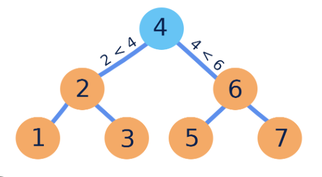
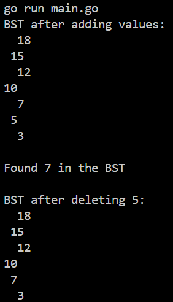

# Binary Search Tree

`BinarySearchTree` is a Go package that provides a simple implementation of a binary search tree (BST).



## Features

- Add elements to the BST
- Delete elements from the BST
- Search for elements in the BST
- Visualize the current state of the BST

## Installation

To install the package, use:

```sh
go get -u github.com/L1z1ng3r-sswe/computer_science/data_structures/binary_search_tree
```

## Usage

### Example

Here's an example demonstrating the usage of the binary search tree:

```go
package main

import (
	"fmt"
	"github.com/L1z1ng3r-sswe/computer_science/data_structures/binary_search_tree"
)

func main() {
	// Create a new BST
	root := &binary_search_tree.BST{Val: 10}

	// Add values to the BST
	root.Add(5)
	root.Add(15)
	root.Add(3)
	root.Add(7)
	root.Add(12)
	root.Add(18)

	fmt.Println("BST after adding values:")
	fmt.Print(root.PrettyVisualise(0))

	// Search for a value
	searchVal := 7
	node := root.Search(searchVal)
	if node != nil {
		fmt.Printf("\nFound %d in the BST\n", searchVal)
	} else {
		fmt.Printf("\n%d not found in the BST\n", searchVal)
	}

	// Delete a value from the BST
	deleteVal := 5
	root = root.Delete(deleteVal)
	fmt.Printf("\nBST after deleting %d:\n", deleteVal)
	fmt.Print(root.PrettyVisualise(0))
}
```

## Methods

### `Add`

Adds a value to the binary search tree.

```go
func (b *BST) Add(val int)
```

### `Delete`

Deletes a value from the binary search tree and returns the new root.

```go
func (b *BST) Delete(val int) *BST
```

### `Search`

Searches for a value in the binary search tree and returns the node if found.

```go
func (b *BST) Search(val int) *BST
```

### `PrettyVisualise`

Returns a string representation of the current state of the binary search tree.

```go
func (b *BST) PrettyVisualise(lvl int) string
```

### `MinNode`

Finds and returns the node with the minimum value in the subtree.

```go
func MinNode(node *BST) *BST
```

## Visualization

When running the example, you will see output similar to the following, showing the state of the binary search tree after each operation:

