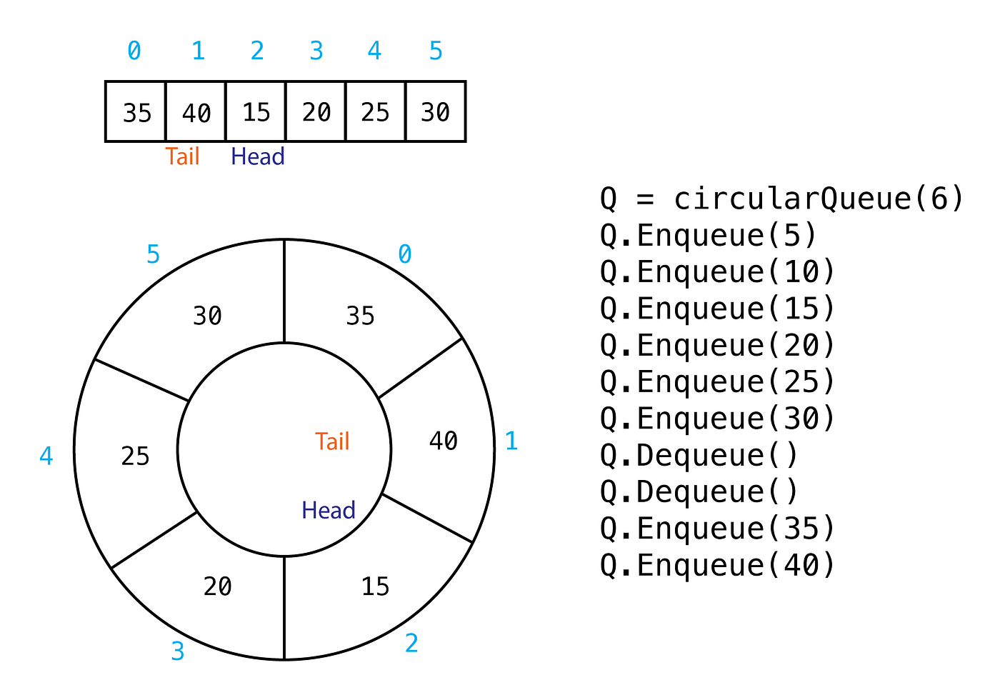

# CircularQueue

`CircularQueue` is a Go package that provides a thread-safe implementation of a circular queue (also known as a ring buffer). This queue allows concurrent enqueue and dequeue operations with blocking when the queue is full or empty.



## Features

- Thread-safe enqueue and dequeue operations
- Blocking on full queue during enqueue
- Blocking on empty queue during dequeue
- Observing the front and last elements of the queue
- Visualization of the current state of the queue

## Installation

To install the package, use:

```sh
go get -u github.com/L1z1ng3r-sswe/computer_science/data_structures/circular_queue
```

## Usage


### Example

Here's an example demonstrating the usage of the circular queue:

```go
package main

import (
    "fmt"
    "time"

    "github.com/L1z1ng3r-sswe/computer_science/data_structures/circular_queue"
)

func main() {
    cq := circular_queue.New(10)

    go overflower(cq)
    go reader(cq)

    // Keep the main function running
    select {}
}

func overflower(cq *circular_queue.CircularQueue) {
    var i int
    for {
        cq.Enqueue(i)
        fmt.Printf("Enqueued: %d\n", i)
        fmt.Println(cq.Visualization())
        i++
        time.Sleep(time.Millisecond * 500)
    }
}

func reader(cq *circular_queue.CircularQueue) {
    for {
        val := cq.Dequeue()
        fmt.Printf("Dequeued: %v\n", val)
        fmt.Println(cq.Visualization())
        time.Sleep(time.Millisecond * 500)
    }
}
```

## Methods

### `New`

Creates a new circular queue with the specified buffer size.

```go
func New(buffSize int) *CircularQueue
```

### `Enqueue`

Adds an element to the queue. If the queue is full, it blocks until space is available.

```go
func (cq *CircularQueue) Enqueue(newData interface{}) interface{}
```

### `Dequeue`

Removes and returns the front element from the queue. If the queue is empty, it blocks until an element is available.

```go
func (cq *CircularQueue) Dequeue() interface{}
```

### `ObserveFront`

Returns the front element without removing it. Returns an error if the queue is empty.

```go
func (cq *CircularQueue) ObserveFront() (interface{}, error)
```

### `ObserveLast`

Returns the last element without removing it. Returns an error if the queue is empty.

```go
func (cq *CircularQueue) ObserveLast() (interface{}, error)
```

### `Visualization`

Returns a string representation of the current state of the queue.

```go
func (cq *CircularQueue) Visualization() string
```

## Visualization

When running the example, you will see output similar to the following, showing the state of the queue after each operation:


The above image shows how the state of the queue changes over time with enqueue and dequeue operations.