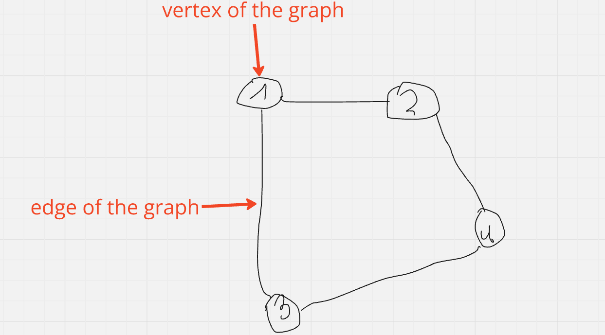
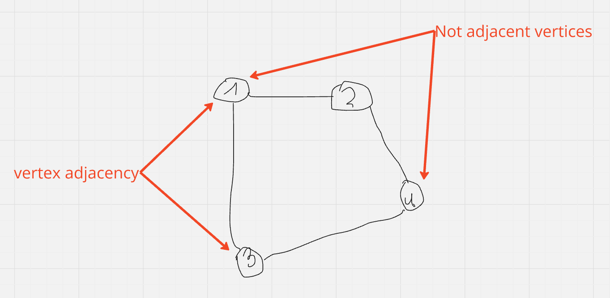
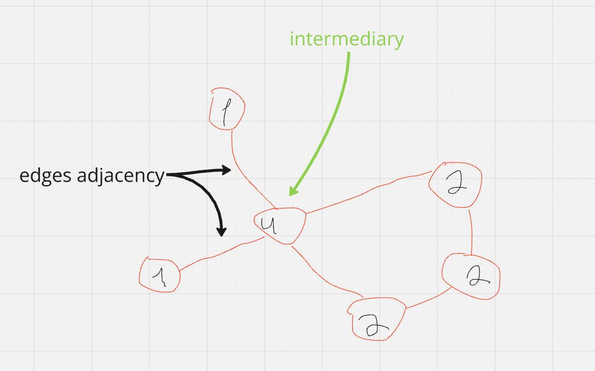
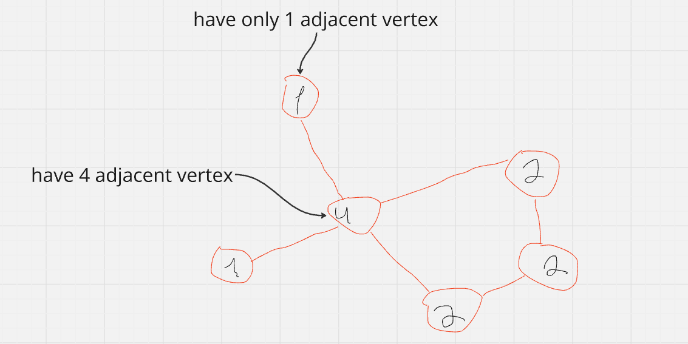
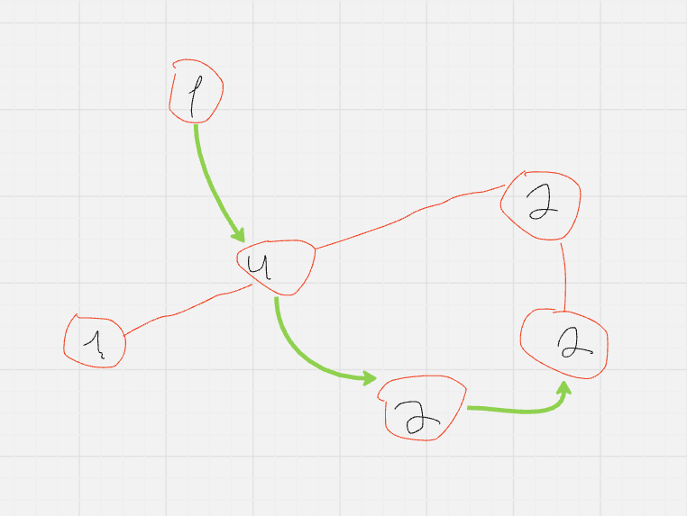

# Graph Data Structure

A graph is a collection of vertices (also called nodes) connected by edges. Vertices represent entities, and edges represent the connections or relationships between these entities.

### Parts of a Graph

- **Vertex (Node)**: A point in the graph representing an entity.
- **Edge**: A line connecting two vertices, representing the relationship between them.

### Adjacency

- **Vertex Adjacency**: Two vertices are adjacent if they are connected by an edge.

- **Edge Adjacency**: Two edges are adjacent if they share a common vertex (intermediary).

### Degree

- **Degrie**: The number of adjacnent vertices (connected edges) of the vertex. In a directed graph, there are in-degrees (incoming edges) and out-degrees (outgoing edges).

### Path

- **Path**: A sequence of vertices where each adjacent pair is connected by an edge.

