# Graph Data Structure

A graph is a collection of vertices (also called nodes) connected by edges. Vertices represent entities, and edges represent the connections or relationships between these entities.

### Parts of a Graph

- **Vertex (Node)**: A point in the graph representing an entity.
- **Edge**: A line connecting two vertices, representing the relationship between them.

### Adjacency

- **Vertex Adjacency**: Two vertices are adjacent if they are connected by an edge.

- **Edge Adjacency**: Two edges are adjacent if they share a common vertex (intermediary).

### Degree

- **Degrie**: The number of adjacnent vertices (connected edges) of the vertex. In a directed graph, there are in-degrees (incoming edges) and out-degrees (outgoing edges).

### Path

- **Path**: A sequence of vertices where each adjacent pair is connected by an edge.

## Types of Graphs

### Trivial Graph

- A graph with only one vertex and no edges.  

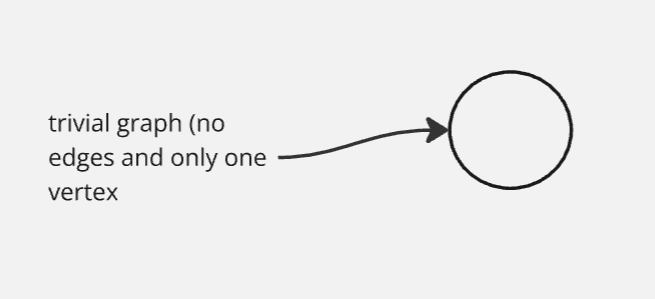

### Null Graph

- A graph with no edges, but possibly multiple vertices.

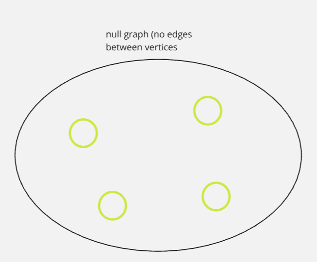

### Connected Graph

- A graph where there is a path between every pair of vertices.

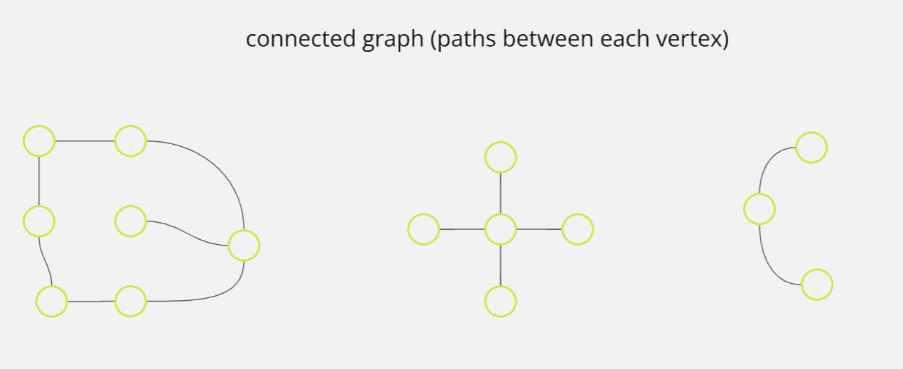

### Disconnected Graph

- A graph where at least one pair of vertices does not have a path between them.

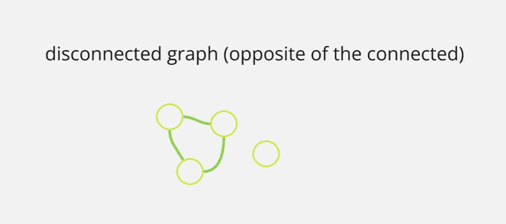

### Cyclic Graph

- A graph that contains at least one cycle (a path that starts and ends at the same vertex).

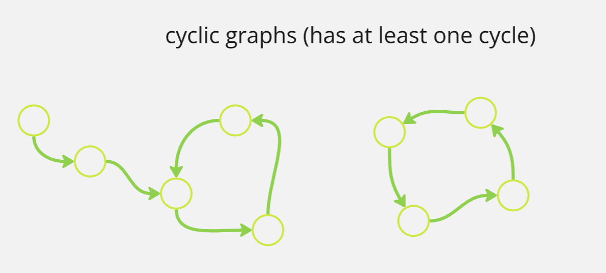

### Acyclic Graph

- A graph with no cycles.

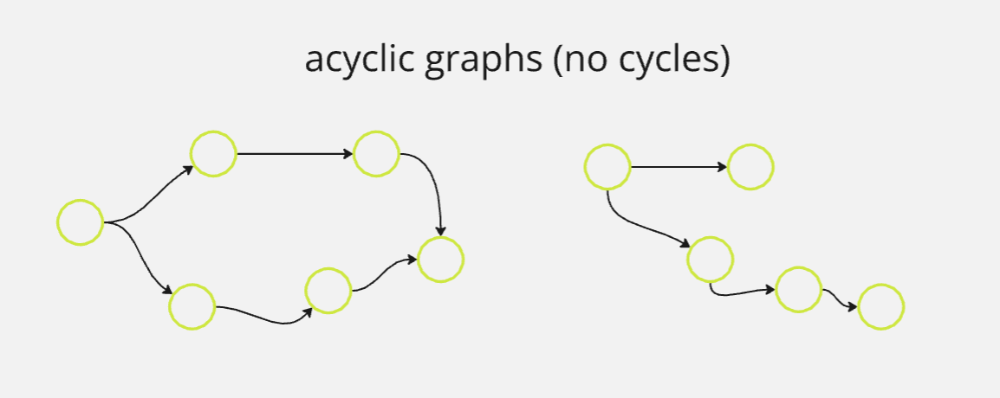

### Simple Graph

- A graph with no loops (edges connected at both ends to the same vertex) and no more than one edge between any two vertices.

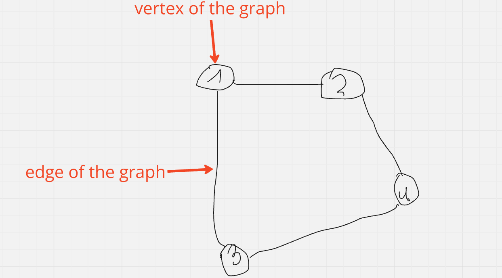

### Multigraph

- A graph that may have multiple edges (parallel edges) between the same pair of vertices.

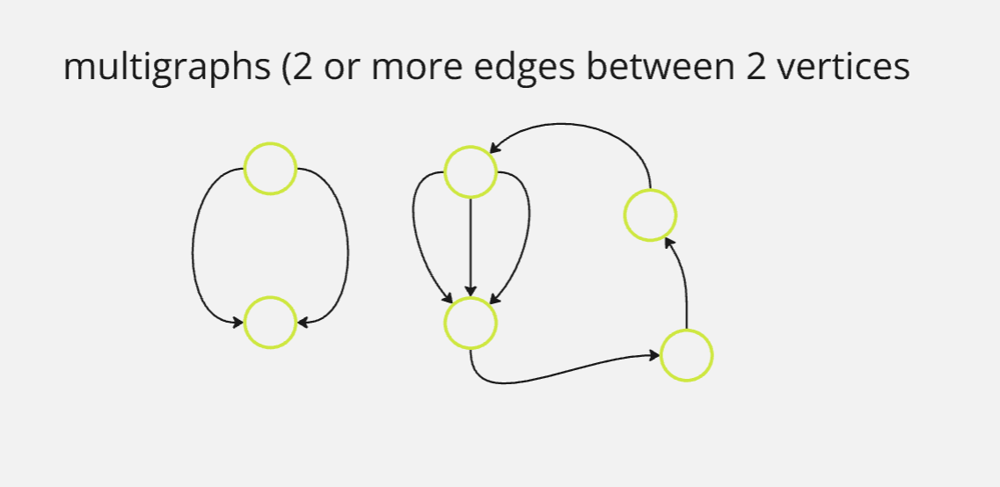

### Regular Graph 

- A graph where each vertex has the same number of edges.

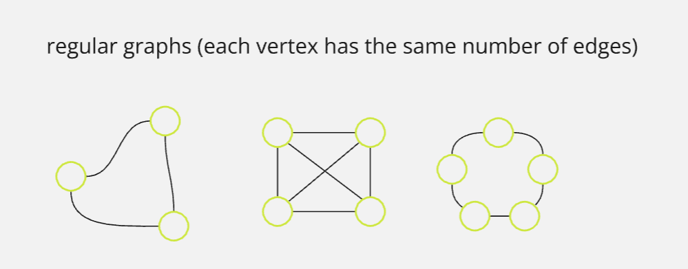

### Complete Graph

- A graph where every pair of vertices is connected by an edge.

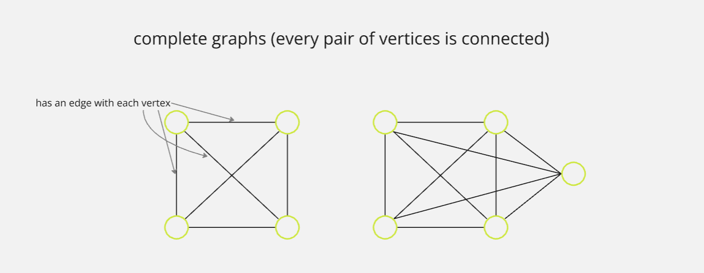

### Pseudo Graph

- A graph that allows loops and multiple edges between the same pair of vertices.

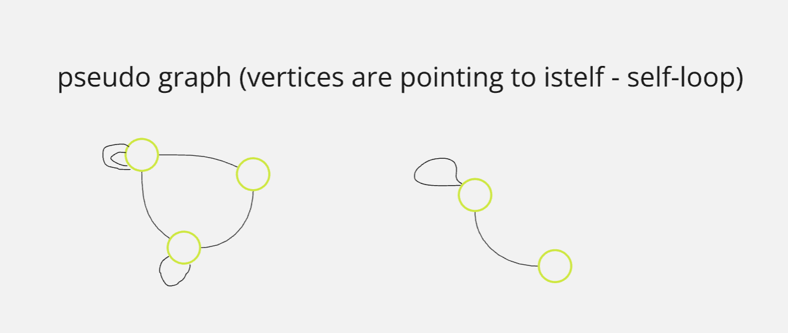

### Directed Graph (Digraph)

- A graph where edges have a direction, indicated by an arrow.

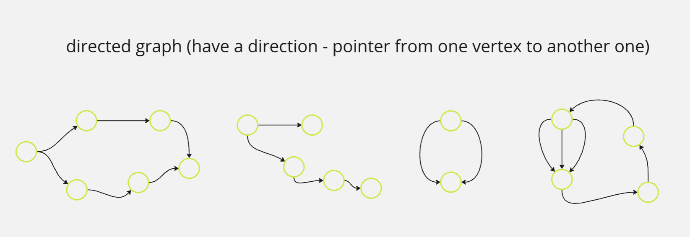

### Undirected Graph

- A graph where edges do not have a direction.

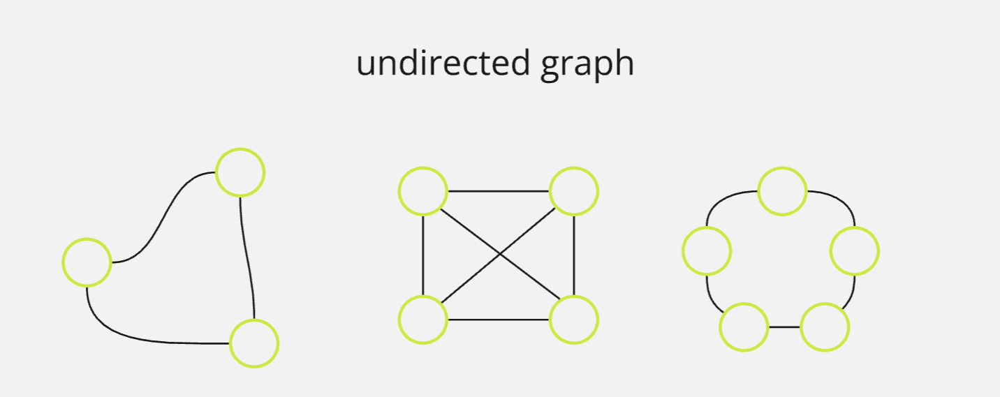

### Weighted Graph

- A graph where edges have weights or costs associated with them.

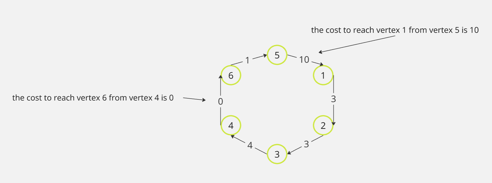

## Graph Representations

### Adjacency Matrix

- A 2D array where the cell at row i and column j represents the presence (and possibly the weight) of an edge between vertices i and j.

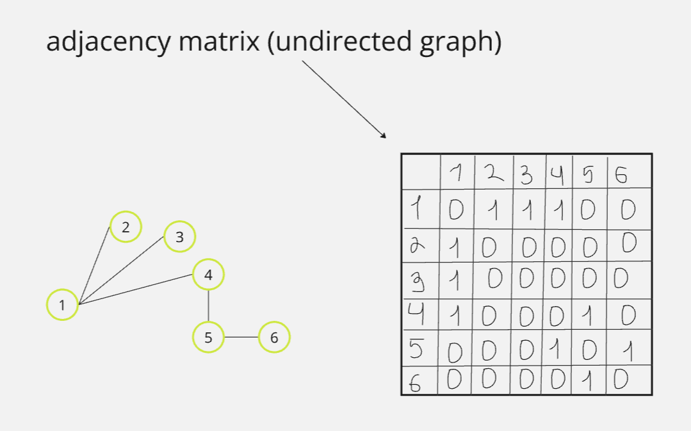

### Adjacency List

- A collection of lists or arrays where each list represents a vertex and contains all the vertices adjacent to it.

