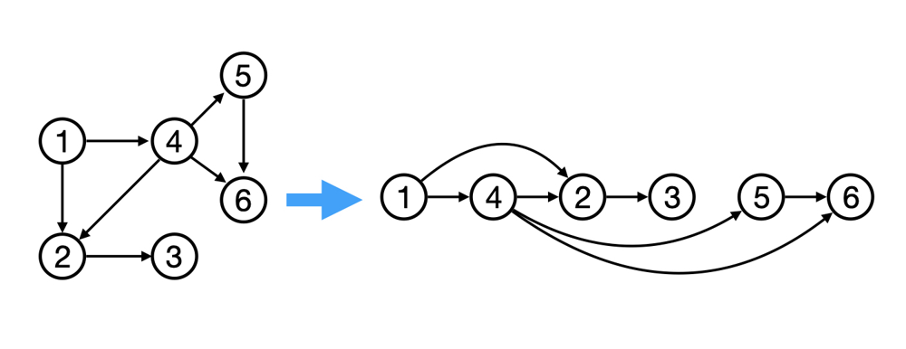

# Topological Sort

Here is the implementation of **Topological Sorting** for a Directed Acyclic Graph (DAG) using **Kahn's Algorithm**.



## Features

- Perform topological sorting of a graph given as a set of vertices and directed edges.
- Detects cycles in the graph. If a cycle is present, topological sorting is not possible, and an error is returned.

## Function Overview

### `TopologicalSort`

```go
func TopologicalSort(numVertices int, edges [][]int) ([]int, error)
```

- **Parameters**:
  - `numVertices`: The number of vertices (nodes) in the graph.
  - `edges`: A 2D slice where each element represents a directed edge from one vertex to another, i.e., an edge from `edges[i][0]` to `edges[i][1]`.

- **Returns**:
  - A slice of integers representing the topologically sorted order of vertices.
  - An error if the graph contains a cycle (which makes topological sorting impossible).

### Example Usage

```go
package main

import (
	"fmt"
)

func main() {
	// Define edges for a graph.
	numVertices := 6
	edges := [][]int{
		{5, 2},
		{5, 0},
		{4, 0},
		{4, 1},
		{2, 3},
		{3, 1},
	}

	// Perform topological sort
	order, err := topological_sort.TopologicalSort(numVertices, edges)
	if err != nil {
		fmt.Println("Error:", err)
	} else {
		fmt.Println("Topological Order:", order)
	}
}
```

### Output

```
Topological Order: [4 5 2 3 1 0]
```

### Error Handling

If the graph contains a cycle, the function will return an error:

```bash
Error: Cycle detected
```

## How It Works

1. **Graph Construction**: The function builds an adjacency list from the input edges.
2. **Usage Calculation**: It tracks the the number of vertices which link to each vertex.
3. **Queue Processing**: All vertices with zero usage number are enqueued and processed. Each time a vertex is processed, the usage number of the vertices it connects to is reduced. If any vertex's in-degree becomes zero, it is added to the queue.
4. **Cycle Detection**: After processing, if not all vertices are processed, it means there is a cycle, and topological sorting is not possible.