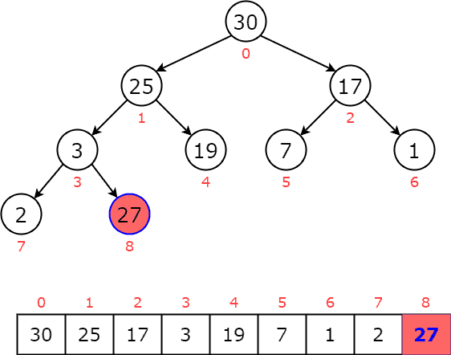

# PriorityQueue 

A generic priority queue implementation in Go and C++ allowing you to define custom comparison logic.

## Visualization

Here's a visual representation of how the priority queue works:

This image illustrates the heap structure used to maintain the priority queue properties during enqueue and dequeue operations.