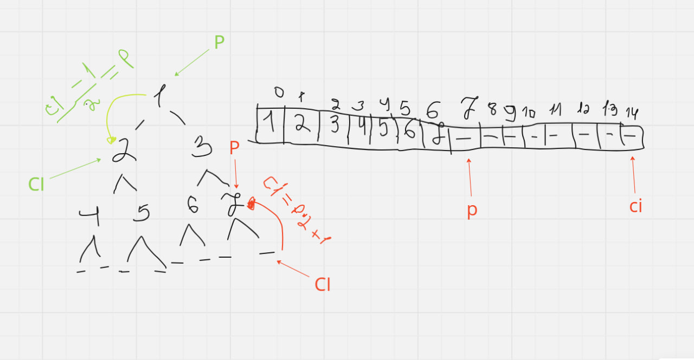

# PriorityQueue 

A generic priority queue implementation in Go, allowing you to define custom comparison logic.

## Installation

To install the package, use:

```sh
go get -u github.com/L1z1ng3r-sswe/computer_science/data_structures/priority_queue
```

## Usage

To use this priority queue library, you'll need to implement the `PriorityQueueImpl` interface for your custom data type. Here's an example implementation for a priority queue of integers.

### Example

Here's an example demonstrating the usage of the priority queue:

```go
package main

import (
	"fmt"

	"github.com/L1z1ng3r-sswe/computer_science/data_structures/priority_queue"
)

type IntPriorityQueueImpl struct {
	data []int
}

func (pq *IntPriorityQueueImpl) Less(i, j int) bool {
	return pq.data[i] < pq.data[j]
}

func (pq *IntPriorityQueueImpl) Equal(i, j int) bool {
	return pq.data[i] == pq.data[j]
}

func (pq *IntPriorityQueueImpl) Empty() bool {
	return len(pq.data) == 0
}

func (pq *IntPriorityQueueImpl) Length() int {
	return len(pq.data)
}

func (pq *IntPriorityQueueImpl) Swap(i, j int) {
	pq.data[i], pq.data[j] = pq.data[j], pq.data[i]
}

func (pq *IntPriorityQueueImpl) Push(data interface{}) interface{} {
	pq.data = append(pq.data, data.(int))
	return data
}

func (pq *IntPriorityQueueImpl) Pop() interface{} {
	if pq.Empty() {
		return nil
	}
	val := pq.data[len(pq.data)-1]
	pq.data = pq.data[:len(pq.data)-1]
	return val
}

func main() {
	intPQImpl := &IntPriorityQueueImpl{data: []int{}}

	pq := priority_queue.New(intPQImpl)

	pq.Enqueue(3)
	pq.Enqueue(1)
	pq.Enqueue(5)
	pq.Enqueue(2)
	pq.Enqueue(4)

	for !intPQImpl.Empty() {
		fmt.Println(pq.Dequeue())
	}
}
```

### Methods

#### PriorityQueueImpl Interface

- `Less(i, j int) bool`: Returns true if the value at index `i` is less than the value at index `j`.
- `Equal(i, j int) bool`: Returns true if the values at indices `i` and `j` are equal.
- `Empty() bool`: Returns true if the priority queue is empty.
- `Length() int`: Returns the length of the priority queue.
- `Swap(i, j int)`: Swaps the values at indices `i` and `j`.
- `Push(data interface{}) interface{}`: Appends the given data to the priority queue.
- `Pop() interface{}`: Removes and returns the last element of the priority queue.

#### PriorityQueue Interface

- `Enqueue(interface{})`: Adds an element to the priority queue.
- `Dequeue() interface{}`: Removes and returns the highest priority element from the priority queue.
- `down(i int)`: Moves the element at index `i` down the queue to maintain the heap property.
- `up(i int)`: Moves the element at index `i` up the queue to maintain the heap property.

## Visualization

Here's a visual representation of how the priority queue works:



This image illustrates the heap structure used to maintain the priority queue properties during enqueue and dequeue operations.