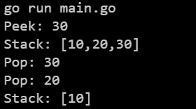

Here is the refined README for your stack package:

# Stack

`Stack` is a Go package that provides a simple implementation of a stack data structure.


## Features

- Push elements onto the stack
- Pop elements from the stack
- Peek at the top element of the stack
- Visualize the current state of the stack

## Installation

To install the package, use:

```sh
go get -u github.com/L1z1ng3r-sswe/computer_science/data_structures/stack
```

## Usage

### Example

Here's an example demonstrating the usage of the stack:

```go
package main

import (
	"fmt"
	"github.com/L1z1ng3r-sswe/computer_science/data_structures/stack"
)

func main() {
	s := stack.New()

	s.Push(10)
	s.Push(20)
	s.Push(30)

	fmt.Println("Peek:", s.Peak())
	fmt.Println("Stack:", s.Visualize())

	fmt.Println("Pop:", s.Pop())
	fmt.Println("Pop:", s.Pop())

	fmt.Println("Stack:", s.Visualize())
}
```

## Methods

### `New`

Creates a new stack.

```go
func New() Stack
```

### `Pop`

Removes and returns the top element from the stack. Returns `nil` if the stack is empty.

```go
func (s *stack) Pop() interface{}
```

### `Push`

Adds an element to the stack. Returns the new size of the stack.

```go
func (s *stack) Push(item interface{}) int
```

### `Peak`

Returns the top element of the stack without removing it. Returns `nil` if the stack is empty.

```go
func (s *stack) Peak() interface{}
```

### `Visualize`

Returns a string representation of the current state of the stack.

```go
func (s *stack) Visualize() string
```

## Visualization

When running the example, you will see output similar to the following, showing the state of the stack after each operation:

