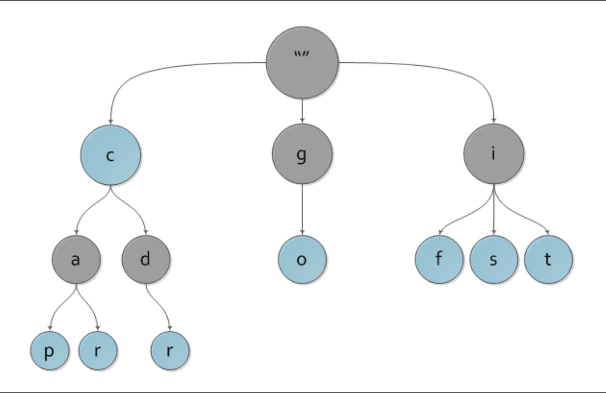

# Trie (Prefix Tree)

Here is a simple Trie data structure implementation both bfs and dfs, that supports inserting, searching for exact words, and finding prefixes.



## Features

- **Insert**: Add a string to the Trie.
- **Search**: Check if an exact word is present in the Trie.
- **FindPrefix**: Check if a prefix exists in the Trie.

## How It Works

A Trie is a tree-like data structure where each node represents a character in a string. It is used for storing strings in a way that makes prefix-based searching efficient. 

This implementation:
1. **Insert**: Takes a string, and for each character in the string, it creates a new node in the Trie if it doesn't exist.
2. **Search**: Looks for the exact match of a word in the Trie.
3. **FindPrefix**: Verifies if a string is a prefix of any word stored in the Trie.

## Usage

```go
package main

import "fmt"

func main() {
	trie := &Trie{Val: "", Next: make(map[byte]*Trie)}

	trie.Insert("computer science")
	fmt.Println(trie.Search("computer science")) // true
	fmt.Println(trie.Search(""))                 // true
	fmt.Println(trie.Search("computer"))         // false
	fmt.Println(trie.FindPrefix("computer sc"))  // true
}
```

### Example Output

```sh
true
true
false
true
```

### Explanation

1. **Insert**: Inserts the string `"computer science"` into the Trie.
2. **Search**: 
   - `Search("computer science")`: Returns `true` as the exact match is found.
   - `Search("")`: Returns `true` since an empty string can be considered a prefix.
   - `Search("computer")`: Returns `false` as `"computer"` isn't a complete word in the Trie.
3. **FindPrefix**:
   - `FindPrefix("computer sc")`: Returns `true` because `"computer sc"` is a prefix of `"computer science"`.

## Methods

### `Insert(word string)`

- Inserts the given word into the Trie.
- **Parameters**: 
  - `word`: The string to be inserted.

### `Search(word string) bool`

- Searches for the exact match of the given word in the Trie.
- **Parameters**: 
  - `word`: The string to search for.
- **Returns**: 
  - `true` if the word is found, otherwise `false`.

### `FindPrefix(word string) bool`

- Checks if the given string is a prefix of any word in the Trie.
- **Parameters**: 
  - `word`: The string to check as a prefix.
- **Returns**: 
  - `true` if the prefix is found, otherwise `false`.