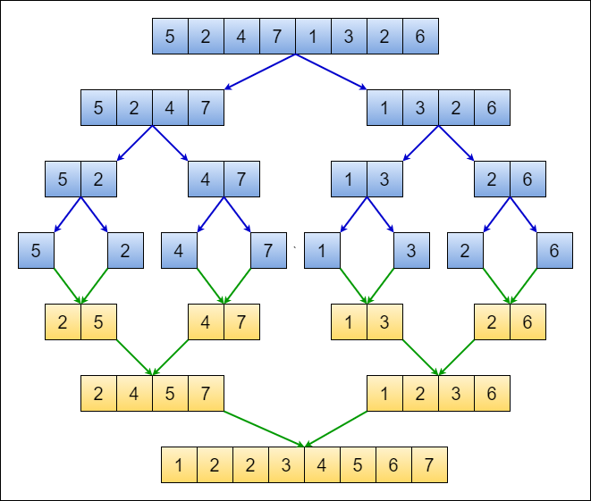

# MergeSort

Here is the Go implementation of the **Merge Sort** algorithm along with a visualization of the sorting process.


## Merge Sort Algorithm

Merge sort is a classic divide-and-conquer algorithm that splits an array into halves, recursively sorts each half, and then merges the sorted halves back together.


## Visualization

```bash
// 	         [1,2,3,4,5,6]
// 		      [1,2,3,4] [5,6]
// 	[1,2], [3,4]       [5], [6]
// [1],[2],[3],[4]       [5,6]
// 	[1,2], [3,4] 
// 		[1,2,3,4]
// 					[1,2,3,4,5,6]
```



The image above shows the binary tree visualization of the merge sort process. It illustrates how the array is split into smaller arrays and then merged back together in sorted order.

